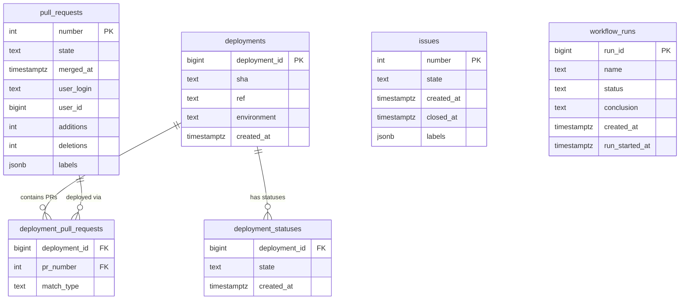
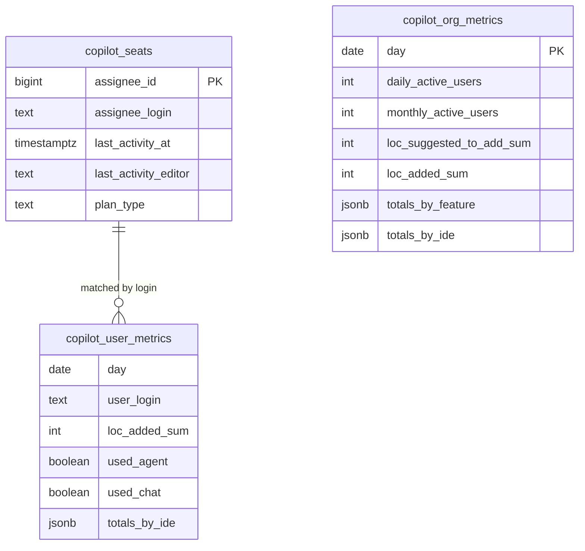
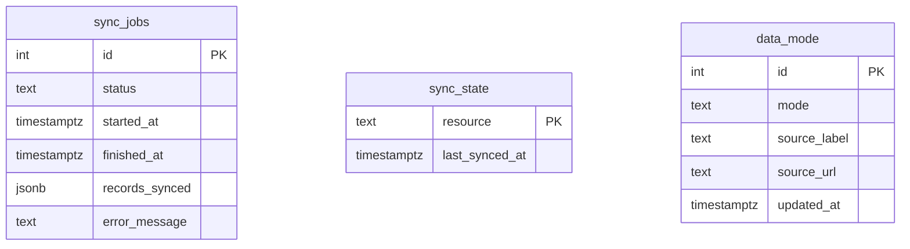

# Custom DORA + Copilot Impact Dashboard v2

GitHub data → PostgreSQL → Grafana. Measures the four DORA pillars plus Copilot adoption and code impact — with a Copilot cohort analysis showing whether Copilot usage correlates with better delivery performance.

## Architecture

**ELT, not ETL.** The sync service is a data courier: it saves raw API responses to `data/raw/`, loads them verbatim into PostgreSQL, and lets Grafana SQL do all the transformation. No views, stored procedures, or application-layer transforms.

```
GitHub API → sync service → data/raw/ → PostgreSQL → Grafana dashboards
```

## GitHub API Client

All GitHub API calls go through the [Octokit REST SDK](https://github.com/octokit/rest.js) — never raw `fetch()` or `axios` directly against GitHub endpoints. Octokit handles authentication headers, rate-limit retries, and pagination automatically.

There are two calling patterns depending on whether Octokit's TypeScript types cover the endpoint:

| Fetcher | Octokit pattern | Why |
|---------|----------------|-----|
| `pull-requests.ts` | `octokit.rest.pulls.*` | Typed; covered by `@octokit/rest` |
| `issues.ts` | `octokit.rest.issues.*` | Typed; covered by `@octokit/rest` |
| `deployments.ts` | `octokit.rest.repos.*` | Typed; covered by `@octokit/rest` |
| `workflow-runs.ts` | `octokit.rest.actions.*` | Typed; covered by `@octokit/rest` |
| `copilot-seats.ts` | `octokit.rest.copilot.*` | Typed; covered by `@octokit/rest` |
| `copilot-org-metrics.ts` | `octokit.request(...)` | `2026-03-10` endpoints not yet in TypeScript types |
| `copilot-user-metrics.ts` | `(octokit as any).request(...)` | Same reason; `as any` cast is intentional — do not remove |

**Why `fetch()` also appears in the Copilot fetchers:** The Copilot metrics API (step 1, via Octokit) responds with a `download_links` list of pre-signed Amazon S3/CDN URLs. These are not GitHub API endpoints — they are temporary file download links hosted on cloud storage, with the credential embedded as URL signature parameters. Your GitHub token is not involved and Octokit has no role. Using `fetch()` here is correct and intentional — it is equivalent to downloading a file attachment, not calling the GitHub API. See the [Copilot Data](#copilot-data) section for a full walkthrough.

---

## Data Sources

This dashboard pulls from two distinct GitHub data sources that behave very differently from each other.

### DORA Data

DORA metrics are derived from four GitHub REST API endpoint groups:

| Data | GitHub API | Used for |
|------|-----------|---------|
| Pull requests | `GET /repos/{owner}/{repo}/pulls` | Lead Time, Deployment Frequency, Cohort |
| Deployments + statuses | `GET /repos/{owner}/{repo}/deployments` | Deployment Frequency, MTTR, Lead Time |
| Issues | `GET /repos/{owner}/{repo}/issues` | Change Failure Rate (`incident` label) |
| Workflow runs | `GET /repos/{owner}/{repo}/actions/runs` | Lead Time (build time component) |

**How the download works:**

The sync service uses the [Octokit](https://github.com/octokit/rest.js) SDK. Each endpoint is paginated — GitHub returns up to 100 records per page with a `Link: next` header pointing to the next page. Octokit's `paginate()` follows these headers automatically until all pages are exhausted.

```
sync-server
  └── octokit.paginate(pulls.list, { per_page: 100 })
        ├── GET /repos/org/repo/pulls?page=1  → 100 PRs
        ├── GET /repos/org/repo/pulls?page=2  → 100 PRs
        └── GET /repos/org/repo/pulls?page=3  → 47 PRs  ← done
```

PRs require a **second API call per record** to fetch `additions`, `deletions`, and `changed_files` — these fields are not included in the list response, only in the individual `GET /pulls/{number}` detail endpoint.

**Incremental syncing:**

After the first full sync, subsequent syncs only fetch records updated since `last_synced_at` (stored in the `sync_state` table). New data is merged into the DB using `ON CONFLICT ... DO UPDATE` (UPSERT) — existing rows are updated, new rows are inserted, nothing is deleted.

---

### Copilot Data

Copilot metrics come from three separate API surfaces:

| Data | GitHub API | Used for |
|------|-----------|---------|
| Seats | `GET /orgs/{org}/copilot/billing/seats` | Who has a license, last activity |
| Org metrics | `GET /orgs/{org}/copilot/metrics/reports/organization-28-day/latest` | Usage aggregates (DAU, LoC, acceptance rate) |
| User metrics | `GET /orgs/{org}/copilot/metrics/reports/users-28-day/latest` | Per-user breakdown |

**How the download works — two hops:**

The Copilot metrics API (version `2026-03-10`) does **not** return data inline. Instead it returns a signed download envelope:

```
Step 1 — Ask GitHub where the report is:
  sync-server
    └── octokit.request('GET /orgs/{org}/copilot/metrics/reports/...')
          └── Response: {
                "download_links": [
                  "https://<storage-host>/.../report-part-1.ndjson?<signature-params>",
                  "https://<storage-host>/.../report-part-2.ndjson?<signature-params>"
                ]
              }

Step 2 — Download each file directly from cloud storage:
  sync-server
    └── fetch("https://<storage-host>/...?<signature-params>")
          └── Response: NDJSON file (one JSON object per line)
```

**Step 1 in detail:** GitHub does not send the metrics data in the API response. Instead it returns a list of pre-signed cloud storage URLs — temporary, time-limited pointers to where the data files live. The signature query parameters embedded in each URL act as the credential; your GitHub token is not needed for step 2. The report may be split across multiple parts (multiple URLs in `download_links`), so the fetcher loops over all of them and concatenates the results. The signed URLs expire shortly after being issued, so they must be fetched promptly.

The file is **NDJSON** (Newline-Delimited JSON) — not a JSON array. Each line is a separate JSON object parsed independently:

```
{"day":"2026-04-01","daily_active_users":42,...}
{"day":"2026-04-02","daily_active_users":45,...}
{"day":"2026-04-03","daily_active_users":38,...}
```

GitHub uses this pattern because 28 days × thousands of users is a large dataset — offloading the bulk transfer to S3 is more efficient than streaming it through GitHub's API servers.

**Full replace, not incremental:**

The Copilot API has no `since` parameter and no cursor. It always returns the current 28-day rolling window. Seats represent *current state* — if someone loses a seat, they simply disappear from the response (no deletion event). For both reasons, Copilot tables are always `TRUNCATE`d before re-inserting on every sync.

**Failure behaviour:**

If the Copilot API returns `403` or `404` (missing `admin:org` scope, Copilot not enabled for the org, etc.), the error is caught per-fetcher and logged as a warning. The sync continues and completes successfully for the DORA data. Check `docker logs v2-sync-server-1 | grep -E "WARN|copilot"` if Copilot panels show no data after a successful sync.

---

## Database Schema

The database has three logical groups of tables.

### DORA tables



The `deployment_pull_requests` bridge table is populated by the **bridge resolver** — it links each deployment to the PRs it contains by matching `deployment.sha` to `pull_request.merge_commit_sha` (direct match) or `pull_request.head_sha` (squash fallback). This bridge is what makes Lead Time and the DORA × Copilot cohort analysis possible.

### Copilot tables



`copilot_seats` and `copilot_user_metrics` are joined by `user_login` in Grafana SQL — there is no FK constraint because the metrics data uses login strings while seats use `assignee_id`. Both tables are fully replaced on every sync.

### Infrastructure tables



- **`sync_jobs`** — audit log of every sync run; powers `GET /api/sync/jobs`
- **`sync_state`** — tracks `last_synced_at` per resource for incremental DORA fetches
- **`data_mode`** — single-row config table read by every Grafana dashboard to render the data source banner

---

## Requirements

- Docker + Docker Compose
- A GitHub Classic PAT with scopes: `repo`, `read:org`, `admin:org`, `actions`
- Node.js 20+ (for local development)

## Quick Start

### 1. Configure environment

```bash
cp .env.example .env
# Edit .env — set GITHUB_TOKEN, GITHUB_ORG, GITHUB_REPO, PG_USER, PG_PASSWORD
```

### 2. Start the stack

```bash
docker-compose up -d postgres grafana
```

### 3. Apply the schema

```bash
bash setup-db.sh
```

### 4. Load data

**Option A — Live sync** (requires valid PAT and real repo):
```bash
docker-compose up sync
```

**Option B — Seed with synthetic data** (works offline):
```bash
npm run seed
```

### 5. Open Grafana

Navigate to http://localhost:3004 (admin / admin).

## Dashboards

| # | Dashboard | Purpose |
|---|-----------|---------|
| 0 | 📊 Engineering Overview | Leadership summary: all KPIs at a glance |
| 1 | 🚀 Deployment Frequency | How often does the team deploy? |
| 2 | ⏱️ Lead Time for Changes | How fast does code reach production? |
| 3 | 🔥 Change Failure Rate | How often do changes cause problems? |
| 4 | 🏥 Mean Time to Recovery | How fast does the team recover from failures? |
| 5 | 🤖 Copilot Adoption & Usage | Who has seats? Who is active? |
| 6 | 💻 Copilot Code Impact | Lines accepted, PR attribution, leaderboards |
| 7 | 🔬 DORA × Copilot Cohort | Does Copilot usage correlate with better DORA metrics? |

## GitHub PAT Scopes

| Scope | Required for |
|-------|-------------|
| `repo` | Pull requests, deployments, issues, workflow runs |
| `read:org` | Copilot org metrics, seats |
| `admin:org` | Copilot billing seats (some orgs require this) |
| `actions` | Workflow runs |

Use a **Classic PAT** (not fine-grained) — Copilot org endpoints may not support fine-grained tokens.

## Mid-Session Re-Sync

Trigger a fresh sync without restarting the stack:
```bash
curl -s -X POST http://localhost:3003/api/sync
# Returns: { "jobId": 5, "status": "started" }

# Monitor progress:
curl http://localhost:3003/api/sync/status/5
```

## Data Mode Banner

Every dashboard shows a banner indicating the data source:

| Mode | Color | Label |
|------|-------|-------|
| `live` | 🟢 Green | 📡 Live Data — your-org/your-repo |
| `seed` | 🟠 Amber | 🌱 Synthetic Seed Data — your-org/your-repo |

Configure via `.env`:
```
DATA_MODE=live               # live | seed
DATA_SOURCE_LABEL=my-org/my-repo
DATA_SOURCE_URL=https://github.com/my-org/my-repo
```

## Copilot Attribution Model

PR attribution is **proxy-based**: a PR is "Copilot-attributed" when the PR author holds an active Copilot seat (`last_activity_at` within 28 days). The GitHub API does not provide per-PR Copilot telemetry. Every Copilot panel that uses PR attribution displays a ⚠️ caveat explaining this.

## DORA Metric Labels

- **Change Fail Rate** requires GitHub issues labeled `incident`
- **Rework Rate** requires PRs labeled `hotfix`, `bugfix`, or `rollback`
- If these labels are not used, those metrics will show 0% — not because failures don't occur, but because they aren't tracked here.

## Development

```bash
npm install
npm run dev          # Start sync server (tsx, hot reload)
npm test             # Unit tests (Vitest)
npm run test:e2e     # E2E tests (Playwright, requires running stack)
```

## Troubleshooting — "No Data" on Dashboards

### 1. Check stack health first
```bash
docker ps
# Confirm v2-postgres-1, v2-sync-server-1, and v2-grafana-1 are all running
docker-compose up -d   # Start any stopped containers
```

### 2. Data not loaded — run seed or sync
```bash
# Check if any rows exist
docker exec v2-postgres-1 psql -U postgres -d dora_metrics -c "SELECT COUNT(*) FROM pull_requests;"

# Option A: Load synthetic data (no PAT required)
npm run seed

# Option B: Trigger a live sync (requires valid .env)
curl -s -X POST http://localhost:3003/api/sync
curl http://localhost:3003/api/sync/status/1   # check progress
```

### 3. Copilot panels show "No data" after sync
A sync can report `status: success` while Copilot tables stay empty — errors are caught per-fetcher and logged as warnings. Check the seat count:
```bash
docker exec v2-postgres-1 psql -U postgres -d dora_metrics -c "SELECT COUNT(*) FROM copilot_seats;"
```
If 0, check the sync server logs:
```bash
docker logs v2-sync-server-1 | grep -E "WARN|ERROR|copilot"
```
Common causes:
- PAT lacks `admin:org` scope — regenerate with `repo`, `read:org`, `admin:org`, `actions`
- Wrong `GITHUB_ORG` value in `.env` (must be org slug, not display name)
- Copilot is not enabled for your organisation
- Fine-grained PAT used instead of Classic PAT

After fixing `.env`, rebuild and restart:
```bash
docker-compose up -d --build
curl -s -X POST http://localhost:3003/api/sync
```

### 4. DORA panels show "No data" — no GitHub Deployments
The deployment-based panels (Deployment Frequency, Lead Time, MTTR, Change Failure Rate) require your repo to use the [GitHub Deployments API](https://docs.github.com/en/rest/deployments/deployments). If your repo uses a different deployment mechanism (e.g., direct Actions runs, external CD), the `deployments` table will be empty.

The `$environment` template variable auto-includes an **All** option, so you will see 0 rather than a broken filter — but you will need to create at least one GitHub Deployment for meaningful data.

### 5. "Lead Time" and cohort panels show "No data" even with deployments
These panels JOIN through `deployment_pull_requests`, which links deployments to the PRs that caused them. The bridge resolver matches `deployment.sha` to `pull_request.merge_commit_sha` (direct) or `pull_request.head_sha` (squash fallback). If your CI pipeline generates synthetic deployment SHAs that don't match any PR SHA, the bridge table stays empty.

Check bridge links:
```bash
docker exec v2-postgres-1 psql -U postgres -d dora_metrics -c "SELECT COUNT(*) FROM deployment_pull_requests;"
```

### 6. Datasource type mismatch (Grafana 12+)
Grafana 12 renamed the PostgreSQL datasource type from `postgres` to `grafana-postgresql-datasource`. Verify the datasource at http://localhost:3004/connections/datasources — a mismatch silently breaks all panels.

### 7. Dashboard banner shows "No data"
The banner reads from the `data_mode` table. If you applied the schema manually without running `setup-db.sh`, insert a row:
```bash
docker exec v2-postgres-1 psql -U postgres -d dora_metrics -c \
  "INSERT INTO data_mode (mode, source_label) SELECT 'seed', 'No data loaded yet' WHERE NOT EXISTS (SELECT 1 FROM data_mode);"
```

## Project Structure

```
v2/
├── src/
│   ├── config.ts              # Env var validation
│   ├── index.ts               # Express server entry point
│   ├── db/
│   │   ├── connection.ts      # PostgreSQL pool
│   │   └── schema.sql         # Full v2 DDL
│   ├── github/                # API fetchers (one file per endpoint group)
│   └── sync/                  # Orchestrator, bridge resolver, state
├── seed/                      # Synthetic data generator
├── scripts/                   # CLI: seed.ts, sync.ts
├── grafana/
│   ├── provisioning/          # Auto-provisioned datasource + dashboard config
│   └── dashboards/            # 8 Grafana dashboard JSON files
├── tests/                     # Vitest unit tests
│   └── e2e/                   # Playwright E2E tests
├── data/raw/                  # Git-ignored; raw API response dumps
├── docker-compose.yml
├── .env.example
└── setup-db.sh
```
